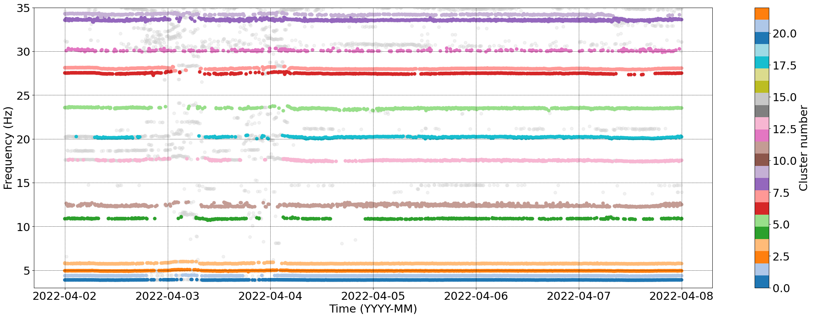

==============
OMA Clustering
==============

Python package to cluster the outputs of an Operational Modal Analysis.
The clusters serve as a basis for automatically setting the configuration of further mode tracking.
The clustering is done using the DBSCAN or HDBSCAN algorithm.

Features
--------

* ModeClusterer_DBSCAN
* ModeClusterer_HDBSCAN

Installation
------------
Before using ModeClusterer, ensure you have the oma_clustering package installed.
If not, you can install it using pip:

.. code-block:: bash

    $ pip install git+https://github.com/WEILMAX/oma_clustering.git
..

Usage
-------
* Importing the class
.. code-block:: python

    from oma_clustering.oma_clustering_dbscan import ModeClusterer_DBSCAN
    from oma_clustering.oma_clustering_hdbscan import ModeClusterer_HDBSCAN
..

* Initializing the class with set of hyperparameters

        * The hyperparameters are used to cluster the dataframe.
        * The multipliers are used to scale the columns of the dataframe before clustering.
        * Ensure the multipliers have the same keys as the columns of the dataframe.
        * The index_divider is used to divide the index of the dataframe to get the index of the dataframe used for clustering.

.. code-block:: python

        clusterer_DBSCAN = ModeClusterer_DBSCAN(
                eps = 5,
                min_samples = 100,
                multipliers = {"frequency": 35, "size": 0.5, "damping": 1},
                index_divider = 20000,
                cols = ['frequency', 'size', 'damping'],
                min_size = 5.0,
                max_damping = 5.0
        )

        clusterer_HDBSCAN = ModeClusterer_HDBSCAN(
                min_cluster_size = 100,
                min_samples = 100,
                multipliers = {"frequency": 500, "size": 0.5, "damping": 1},
                index_divider = 20000,
                cols = ['frequency', 'size', 'damping'],
                min_size = 5.0,
                max_damping = 5.0
        )
..

* Data description

        * The dataframe should contain the following columns: frequency, size, damping, index.
        * The index should be the index of the dataframe used for clustering.
        * The dataframe should contain the modes of the structure.
        
* Fitting the class with a dataframe

        Fit the model using your OMA result data:

.. code-block:: python
        
        clusterer_DBSCAN.fit(oma_result)
        clusterer_HDBSCAN.fit(oma_result)
..

* Getting the clusters
        Predict clusters and filter out the noise:

.. code-block:: python

        clustered_modes_DBSCAN = clusterer_DBSCAN.predict(min_cluster_size=200)
        clustered_modes_DBSCAN = clustered_modes_DBSCAN[clustered_modes_DBSCAN.labels != -1]

        clustered_modes_HDBSCAN = clusterer_HDBSCAN.predict(min_cluster_size=200)
        clustered_modes_HDBSCAN = clustered_modes_HDBSCAN[clustered_modes_HDBSCAN.labels != -1]
..

Example
-------
* Here is a complete example of using ModeClusterer_DBSCAN:

.. code-block:: python

        from oma_clustering.oma_clustering_dbscan import ModeClusterer_DBSCAN

        clusterer_DBSCAN = ModeClusterer_DBSCAN(
                eps = 5,
                min_samples = 100,
                multipliers = {"frequency": 35, "size": 0.5, "damping": 1},
                index_divider = 20000,
                cols = ['frequency', 'size', 'damping'],
                min_size = 5.0,
                max_damping = 5.0
        )

        clusterer_DBSCAN.fit(oma_result)

        clustered_modes_DBSCAN = clusterer_DBSCAN.predict(min_cluster_size=200)
        clustered_modes_DBSCAN = clustered_modes_DBSCAN[clustered_modes_DBSCAN.labels != -1]
..

* Here is a complete example of using ModeClusterer_HDBSCAN:

.. code-block:: python

        from oma_clustering.oma_clustering_hdbscan import ModeClusterer_HDBSCAN

        clusterer_HDBSCAN = ModeClusterer_HDBSCAN(
                min_cluster_size = 100,
                min_samples = 100,
                multipliers = {"frequency": 500, "size": 0.5, "damping": 1},
                index_divider = 20000,
                cols = ['frequency', 'size', 'damping'],
                min_size = 5.0,
                max_damping = 5.0
        )

        clusterer_HDBSCAN.fit(oma_result)

        clustered_modes_HDBSCAN = clusterer_HDBSCAN.predict(min_cluster_size=200)
        clustered_modes_HDBSCAN = clustered_modes_HDBSCAN[clustered_modes_HDBSCAN.labels != -1]
..

Resulting clustering
--------------------
* Example of a resulting clustering using ModeClusterer_DBSCAN:

* Example of a resulting clustering using ModeClusterer_HDBSCAN:
.. figure:: figures/clustering/OMA7/HDBSCAN_clustering.png
        :align: center
        :alt: Example of a resulting clustering using ModeClusterer_HDBSCAN.

Credits
-------

This package was created in the context of the NWE Interreg 'Smart Circular Bridge' project.
For more information, see https://vb.nweurope.eu/projects/project-search/smart-circular-bridge-scb-for-pedestrians-and-cyclists-in-a-circular-built-environment/